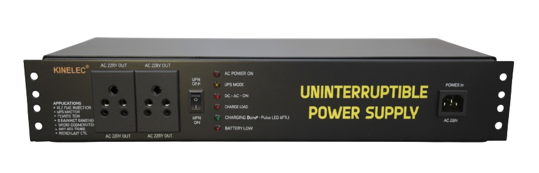
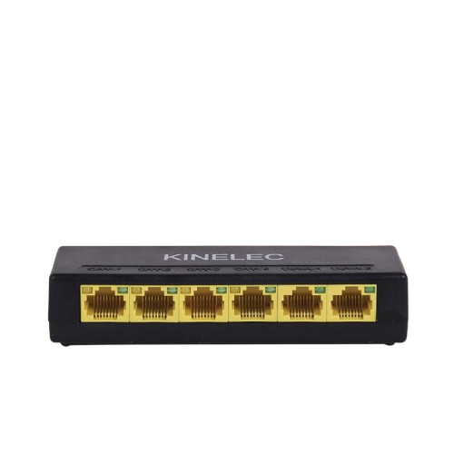

# KINELEC
<!DOCTYPE html>
<html lang="en">
<head>
<meta charset="UTF-8">
<title>Kine Scope Electronics</title>
<meta name="viewport" content="width=device-width, initial-scale=1.0">

</head>

<body>

<!-- LOGO BAR -->

  
  

<!-- HERO -->

  

    <h1>KINE SCOPE ELECTRONICS</h1>
    

      Engineering intelligent electronic solutions with precision,
      energy, and future-ready design.
    

  

<section class="reveal">
<h2>About Us</h2>

Kine Scope Electronics delivers professional electronic and automation
solutions engineered for performance, reliability, and long-term value.

</section>

<section class="reveal">
<h2>What We Do</h2>

  

    <h3>Electronic Design</h3>
    
Custom electronics built with precision engineering.

  

  

    <h3>Automation & Control</h3>
    
Smart automation systems for modern industries.

  

  

    <h3>Intelligent Systems</h3>
    
Future-ready electronics with intelligent integration.

  

</section>

<section class="reveal">
<h2>Product Catalog</h2>

 

    
    <h4>PoE EXTENDER</h4>
    

    <a href="poe extender.pdf" target="_blank"> Download PDF</a>
  

  

    
    <h4>Power Supply Units</h4>
    

    <a href="CCTV POWER SUPPLY.pdf" target="_blank"> Download PDF</a>
  

  

    
    <h4>12 V DC UPS FOR Wi-Fi ROUTERS.</h4>
    

    <a href="12 VOLT DC UPS.pdf" target="_blank"> Download PDF</a>
  

  

  
  <h4>OLT UPS</h4>
  

  <a href="OLT UPS.pdf" target="_blank"> Download PDF</a>
 

 

   
   <h4>CCTV PoE SOLUTIONS</h4>
   

   <a href="(4+2)&(8+2) POE SOLUTION.pdf" target="_blank"> Download PDF</a>
 

 
 
   <h4>KINELEC</h4>
   
KINELEC ALL PRODUCT DETAILS.

   <a href="catalogue.pdf" target="_blank"> Download PDF</a>
 

</section>

<section class="reveal">
<h2>Enquiry Form</h2>
<form>
  <input type="text" placeholder="Your Name" required>
  <input type="contact" placeholder="Your Contact no." required>
  <input type="text" placeholder="Your Email">
  <textarea placeholder="Describe your requirement"></textarea>
  <button type="submit">Send Enquiry</button>
</form>
</section>

<footer>
© 2026 Kine Scope Electronics. All rights reserved.
</footer>

</body>
</html>
